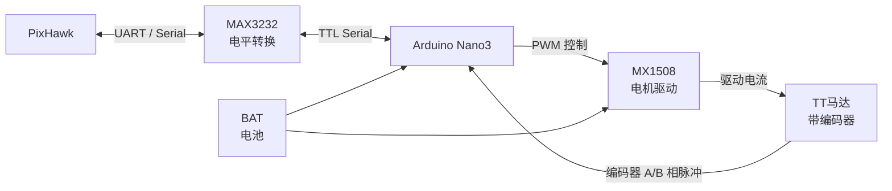

# 描述

这是一个风筝的绞盘的硬件设备。类似与Daiwa Winch。

# 硬件构成

- 主控芯片为Arduino Nano3 Compatible（LGTBF328P）
- 经由USB-TTL(MAX3232)电平转换连接PixHawk 2.4.8(PX4 v1.14.4)
- Arduino连接带AB相位霍尔编码器的 TT电机
- Arduino通过MX1508驱动TT电机

## 电机参数

- 减速比：1：48
- 输出轴转速：300rpm
- 编码器类型：AB相霍尔编码器90度正交编码器（可车速我方向）
- 编码器线数：13线
- 编码器说明：编码器带上拉输出，单片机可以直接采集
- 额定电压： 3v - 9v
- 额定电流： 200mA
- 额定扭矩：1.5 kg・cm
- 接口类型：PH2.0-6P
- 电机脉冲数：
  - 单相计数： 磁环单圈脉冲数*齿轮减速比（13*48=624）
  - 4倍频计数： 磁环单圈脉冲数*齿轮减速比（13*48\*4=2496）

# 软件构成

这个项目控制的是风筝的俯仰角，PX4 提供了一个更适合的通用命令：MAV_CMD_DO_SET_ACTUATOR。
PX4 支持将某个输出（可以是串口透传的外部设备）映射为 Peripheral via Actuator Set 1，然后通过 MAV_CMD_DO_SET_ACTUATOR 的 param1 发送一个 -1 到 1 的归一化值。这个值可以完美对应“俯仰角”指令：

- -1 = 俯仰角最小/最上（或对应预定义的极端位置）
- 0 = 中位
- 1 = 俯仰角最大/最下

Arduino Nano 不需要理解“风筝”或“俯仰”，它只需要，

1. 监听串口收到的 COMMAND_LONG 消息。
2. 识别 command = 183（MAV_CMD_DO_SET_ACTUATOR 的 ID）。
3. 提取 param1（float 类型，范围 -1.0 到 1.0）。
4. 将这个浮点数线性映射为电机的目标位置或目标角度。
   例如：target_angle = param1 \* 90.0（如果范围是 ±90°）。
5. 通过霍尔编码器闭环，驱动电机到达该角度。

Arduino 监听串口原始字节流，仅提取 COMMAND_LONG 消息中的 command 字段（第 28-29 字节）和 param1 字段（第 30-33 字节）。只要检测到 command == 183，就读取 param1。这种方法不需要解析整个 MAVLink 结构，适合 LGTBF328P。

## PX4 侧修改

PX4 不需要写代码，只需要配置一个串口来发送 MAVLink 指令流。

1. 分配 MAVLink 实例到目标串口
   在 QGroundControl 的“参数”页面，把要连接 Arduino 的那个串口（例如 TELEM2 或 TELEM3）分配给一个 MAVLink 实例。

- 设置 MAV_1_CONFIG（或 0/2）= 该串口对应的端口值（例如 TELEM2）。
- 设置 MAV_1_MODE = Onboard 或 Normal。Onboard 模式的消息集更精简，适合带宽有限的串口。
- 设置对应的波特率参数（如 SER_TEL2_BAUD）与 Arduino 匹配。
- 重启飞控使参数生效。

2. 确保 DO_SET_ACTUATOR 命令能发到该串口
   PX4 收到地面站或任务发来的 MAV_CMD_DO_SET_ACTUATOR 后，会把它当作普通 MAVLink 消息，广播到所有配置为 MAVLink 实例的串口上。所以，只要 Arduino 接在某个已配置为 MAVLink 的串口上，它就能收到这个命令。
3. 不需要配置“Peripheral via Actuator Set”输出功能
   这是方案 B 和方案 A 的关键区别。方案 A 需要把 Peripheral via Actuator Set 1 映射到某个物理 PWM 输出引脚；方案 B 里，Arduino 就是“外设本身”，PX4 只是把 MAVLink 指令原样发到串口，不关心谁在听。所以 Actuator 配置页面里不需要做任何输出功能分配。

## Arduino 侧代码

LGTBF328P（Arduino Nano 兼容）的 RAM 只有 2KB，无法运行标准 MAVLink 库（初始化解析器就需要近 3KB）。因此必须用状态机 + 字节匹配的方式，只截取需要的两个字段。

需要解析的 COMMAND_LONG（消息 ID 76）关键字节位置（MAVLink v2 帧格式）：

- 命令 ID 位于 payload 的固定偏移，MAV_CMD_DO_SET_ACTUATOR 的值为 183。
- param1 是一个 4 字节的 float，位于命令 ID 之前或之后（取决于 v1/v2 帧结构）。

由于 Arduino 不解析完整 MAVLink，需要在字节流中搜索特征值 183，然后向前/向后定位 float 类型的 param1。更稳妥的做法是搜索 COMMAND_LONG 的帧特征，但这在 Nano 上实现较复杂。

一个可行且简化的策略：
既然 PX4 会持续广播 MAVLink 流，Arduino 可以只监听包含字节值 183 的帧。当检测到 183 时，读取紧随其后的 4 个字节（MAVLink v1 中 command 后是 param1；v2 中 payload 顺序固定）。将 4 字节重组为 float，这就是目标俯仰角（范围 -1.0 到 1.0）。然后映射到电机目标角度，执行 PID 闭环。

### 为什么不推荐在 Arduino 上跑完整 MAVLink 库

mavlink-arduino 库在 Nano 上编译时，仅解析器初始化就需要 2959 字节 RAM，而 Nano 只有 2048 字节，根本跑不起来。即使裁剪到只解析一个消息，底层解析器的内存开销依然存在。简化字节匹配方案，是 Nano 级别硬件唯一现实的选择。
